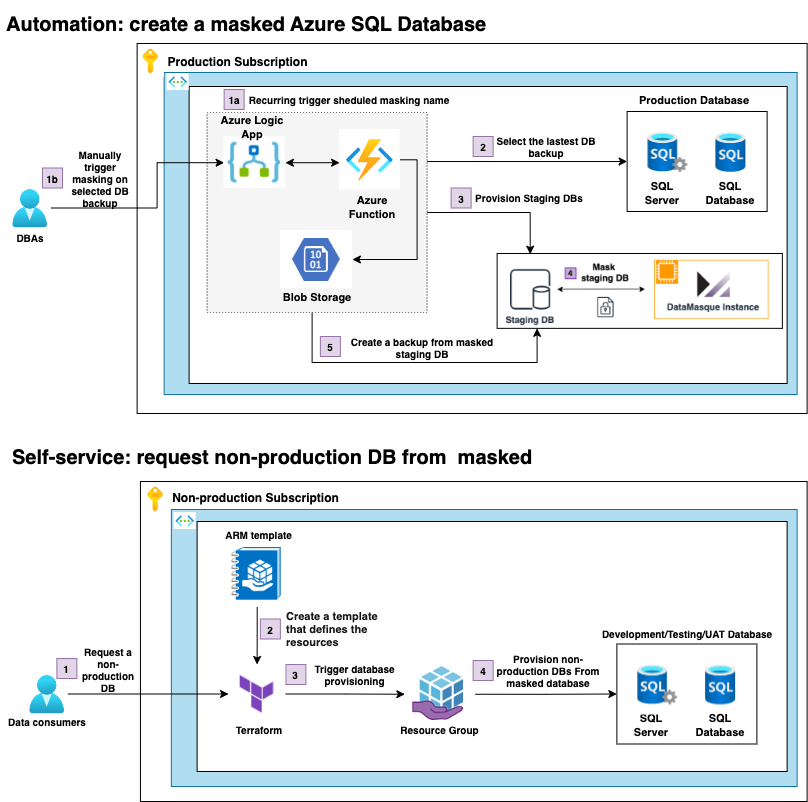
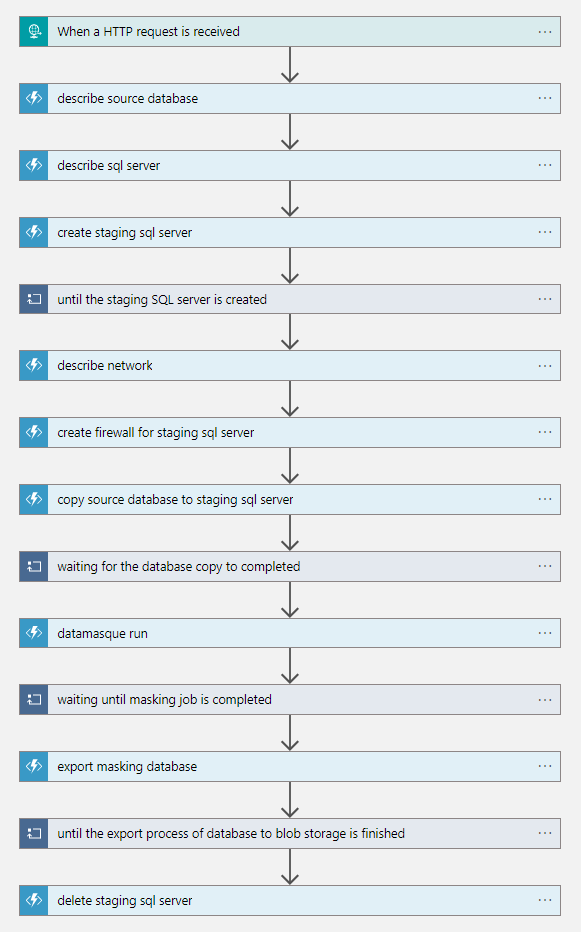

# Azure SQL Masking with Logic Apps — DataMasque Reference Blueprint

> **Reference blueprint — adapt to your environment.** This repository is a
> starting point, not a turnkey product. Review and harden IAM, networking,
> secrets, and TLS for your own environment before any production use.

[DataMasque](https://datamasque.com) replaces sensitive production data with
realistic but fictitious data so teams can build, test, and analyse without
exposing PII. This blueprint automates that for **Azure SQL**: it provisions an
Azure Logic App and Azure Functions that copy a production Azure SQL database
into a short-lived staging server, run a DataMasque masking job against that
copy, export the masked result to a private blob as a `.bacpac`, and tear the
staging server down. The output is a masked, restorable backup you can use to
provision non-production databases — production PII never leaves your tenant.

**Learn more:** [datamasque.com](https://datamasque.com) ·
[Product docs](https://datamasque.com/portal/documentation/) ·
[Book a demo](https://datamasque.com/request-a-demo)

---

## Introduction

The diagram below describes the DataMasque reference architecture in Azure. This
blueprint creates a masked backup copy of a production Azure SQL database, which
can then be used to provision a masked non-production database.



The following Azure resources are provisioned by the blueprint:
* Azure Logic App
* Azure Function App
* Azure Storage Account

## Deployment

### Prerequisites
* Active Azure Subscription with a user account that has the **Owner** role.
* [Azure CLI](https://learn.microsoft.com/en-us/cli/azure/install-azure-cli).
* [Terraform](https://developer.hashicorp.com/terraform/install) and
  [Azure Functions Core Tools](https://learn.microsoft.com/en-us/azure/azure-functions/functions-run-local).
* Python 3.12 (the Function App runs on Python 3.12).
* A DataMasque instance.
* An Azure SQL server and SQL database (the source database).
* A DataMasque Connection ID and Ruleset ID. The connection **must** target the
  staging server, whose name is the source server name with a `-datamasque`
  suffix. For example, if your source SQL server is
  `dm-azure-mssql.database.windows.net`, configure the connection to
  `dm-azure-mssql-datamasque.database.windows.net`. The connection ID **must
  not** point at the production database.

### Step-by-step process to deploy the Logic App

#### 1. Store credentials in Azure Key Vault
Store the DataMasque login credentials and the Azure SQL server administrator
credentials as a single Key Vault secret in the following format:
```json
{
  "administratorLogin": "sqlserveradmin",
  "administratorLoginPassword": "sqlserverpassword",
  "username": "datamasque",
  "password": "Example$P@ssword"
}
```

#### 2. Provide the deployment parameters
Set the following in `terraform_scripts/configs.tfvars` (these map 1:1 to the
variables in `terraform_scripts/variables.tf`):

| Parameter | Description |
|-----------|-------------|
| `subscription_id` | Azure Subscription ID where the resources are deployed. |
| `tenant` | Azure tenant ID (from the service principal creation step). |
| `appId` | Service principal app (client) ID. |
| `password` | Service principal client secret. |
| `resource_group_location` | Azure region for the new resource group (e.g. `Australia East`). |
| `datamasque_base_url` | DataMasque instance URL, e.g. `https://<instance-private-ip>/`. |
| `datamasque_connection_id` | DataMasque connection ID (must target the `-datamasque` staging server). |
| `datamasque_ruleset_id` | DataMasque ruleset ID. |
| `datamasque_keyvault` | Azure Key Vault name holding the secret above. |
| `keyvault_resource_group` | Resource group that contains the Key Vault. |
| `secret_name` | Key Vault secret name. |
| `source_db_instance_identifier` | Source Azure SQL server name. |
| `source_resource_group` | Resource group that contains the source Azure SQL server. |
| `database_id` | Source Azure SQL database ID. |
| `prefix` | Short prefix for created resource names (letters only). |
| `interval_time` | Poll interval in seconds for the Logic App wait loops (default `120`). |
| `max_wait_iterations` | Max poll iterations per wait loop before it gives up (default `720`); the per-loop `PT1H` timeout is the real ceiling. Raise both for masking runs expected to exceed an hour. |
| `datamasque_verify_tls` | `true` (default) verifies the DataMasque TLS certificate; set `false` only for self-signed/private instances (see TLS note below). |
| `run_secret` | DataMasque run secret, sourced from configuration — never commit a literal. |
| `allow_azure_services` | `false` (default) — the staging server only inherits the source server's firewall rules. Set `true` to also add the Azure SQL "Allow Azure services" (`0.0.0.0`) rule, needed only if the DataMasque instance reaches staging as an Azure service without a static IP. |

#### 3. Network configuration
The blueprint relies on the following network configuration to run successfully:
* Allow inbound connections from the DataMasque instance to the source Azure SQL
  server. This configuration is replicated on the staging Azure SQL server
  created during execution.
* The DataMasque instance must allow inbound connections from the
  **datamasque_run** and **wait_datamasque_job** functions.
* Grant the Azure Function permission to read the Key Vault secret.

#### 4. Deploy
```bash
cd terraform_scripts
terraform init
terraform apply -var-file=configs.tfvars
```

### Logic App Execution
#### Invoke an execution manually
You can manually trigger the Logic App with the JSON below. The Logic App uses
the values from the trigger body instead of the predefined parameters.
```json
{
    "DBInstanceIdentifier": "source_sql_database",
    "ResourceGroup": "source_resource_group",
    "DATAMASQUE_CONNECTION_ID": "20f5436c-74a5-4a08-8e12-0c00f5f2787a",
    "DATAMASQUE_RULESET_ID": "d0725d9d-c7bf-4736-863d-a994c0f3f8e3"
}
```
The DataMasque connection ID provided above **must not** be configured to
connect to the production database.

#### Schedule data masking execution
The recurring Logic App schedules a trigger once a week and is disabled by
default.
```json
"triggers": {
    "Recurrence": {
        "recurrence": {
            "frequency": "Day",
            "interval": 7
        },
        "type": "Recurrence"
    }
}
```

#### Notes
* The staging SQL server uses the same name as the source server with a
  `-datamasque` suffix:

| SQL server | Endpoint |
|------------|----------|
| Source SQL server | ``source-sql``.database.windows.net |
| Staging SQL server | ``source-sql-datamasque``.database.windows.net |

* The Azure SQL server username and password are obtained from Azure Key Vault.
* **The staging Azure SQL server is deleted on every terminal outcome —
  success or failure — so no unmasked clone of production is left running.** If
  a run is interrupted before cleanup, delete the orphaned staging server
  manually (see Recovery below).
* The masked `.bacpac` backup is written to a **private** blob (public access is
  disabled on the storage account and container). Retrieve it with an
  authenticated request or generate a SAS token.

### Recovery — delete an orphaned staging server
If a run is interrupted before the cleanup step, remove the leftover staging
server (named `<source-server>-datamasque`) with the Azure CLI:
```bash
az sql server delete \
  --name <source-server>-datamasque \
  --resource-group <source_resource_group> \
  --subscription <subscription_id> \
  --yes
```

### TLS verification
By default the functions verify the DataMasque instance's TLS certificate. For a
self-signed or private DataMasque instance, set `datamasque_verify_tls = false`
in `configs.tfvars` (surfaced to the functions as the `DATAMASQUE_VERIFY_TLS`
app setting). Disabling verification removes protection against
man-in-the-middle attacks — use it only for a trusted, private instance.

### Azure Function definition
The following table describes the steps of the Logic App workflow.

| Step | Description |
|------|-------------|
| Describe source database | Fetch the database with the latest creation time in the target Azure SQL server (single database) |
| Describe SQL server | Fetch the configuration of the target Azure SQL server |
| Create staging SQL server | Create a staging Azure SQL server from the source server's configuration |
| Wait | Until the staging SQL server is created |
| Describe network | Get all public IP addresses in the resource group |
| Create firewall for staging SQL server | Create a firewall rule for the staging Azure SQL server |
| Copy source database to staging SQL server | Take a transactionally consistent snapshot copy of the source database |
| Wait | Until the database copy completes |
| DataMasque run | Create a masking job from the connection ID and ruleset provided |
| Wait | Until the masking job completes |
| Export masking database | Export the masked database to private blob storage |
| Wait | Until the database export completes |
| Delete staging SQL server | Delete the staging Azure SQL server (runs on success and on failure) |



---

## Related DataMasque blueprints

- [AWS RDS masking (Step Functions)](https://github.com/datamasque/DataMasque-AWS-RDS-masking-stepfunctions-blueprint)
- [AWS Service Catalog DB provisioning](https://github.com/datamasque/DataMasque-AWS-service-catalog-database-provisioning-blueprint)
- [AWS Cross-Account Bucket Access](https://github.com/datamasque/DataMasque-AWS-Cross-Account-Bucket-Access)
- [AWS ECS Deployment](https://github.com/datamasque/DataMasque-AWS-ECS-Deployment)
- [masque-bricks (Databricks)](https://github.com/datamasque/masque-bricks)
