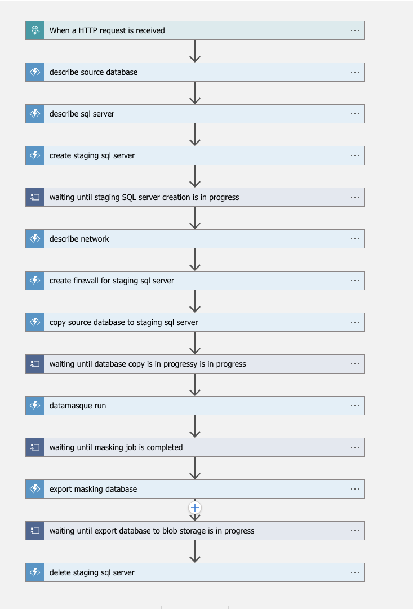

# Terraform Azure
## Introduction
The diagram below describes the DataMasque reference architecture in Azure. This Resource Group template is used to mask production Azure SQL database, create masked database which can be used to provision non-production databases.


The following list the main Azure resources provisioned when this Resource Group template is deployed:
* Azure Logic App
* Azure Function App
* Azure Storage Account

## Deployment
### Prerequisites
* An Azure Subscription active and User account that has **owner role** in Azure Subscription.
* Azure CLI: https://docs.microsoft.com/en-us/cli/azure/install-azure-cli
* Python runtime 3.9.7 installed.
* A DataMasque instance.
* Azure SQL server and SQL database (source database).
* DataMasque `connection id` and `ruleset id`.

### Step-by-step
###### Store the DataMasque instance credentials and account login Azure SQL server on Azure Key vault.
Make sure you have created a secret with the format below:
```json
{
  "administratorLogin": "sqlserveradmin",
  "administratorLoginPassword": "sqlserverpassword",
  "username": "datamasque",
  "password": "Example$P@ssword"
}
```
###### Before deploying the template, please make sure you have the value for the following parameters:
| Parameter                                                                                                              | Description                                                                                                                    |
|------------------------------------------------------------------------------------------------------------------------|--------------------------------------------------------------------------------------------------------------------------------|
| SubscriptionId                                                                                                      | Subscription id where you want to add resource.                                    |
| ResourceGroup                                                                                                      | Resource Group where you want to add resource.                                    |
| DatamasqueBaseUrl                                                                                                      | DataMasque instance URL with the EC2's private IP, i.e. https://\<ec2-instance-private-ip>.                                    |
| DatamasqueKeyVault                                                                                                    | Azure Keyvault name.                                                                                   |
| SecretName                                                                                                    | Secret name contains DataMasque instance credentials. vault.                                                                                   |
| DatamasqueConnectionId                                                                                                 | DataMasque connection ID.                                                                                                      |
| DatamasqueRuleSetId                                                                                                    | DataMasque rulset ID.                                                                                                          |
| StorageUrl                                                                                                    | Storage Account Url.                                                                                                          |
| StorageKey                                                                                                    | Storage Account Key.                                                                                                          |

###### Please ensure the following network connectivities are configured after deploying the Resource Group
* The source Azure SQL server allow inbound connections from the DataMasque instance. The configuration will be replicated when creating the staging Azure SQL server.
* The DataMasque instance allow inbound connections from the **datamasque_run** function.
* The DataMasque instance allow inbound connections from the **wait_datamasque_job** function.
* Grant permissions for Azure function to use the Key vault secret.
* Provides access key of Azure Storage allow inbound connections from Azure Function.

### Step Function Execution
#### Invoke an execution manually
You can alse execute the step function manually:
```json
{ "DBInstanceIdentifier": "source_sql_database", "ResouceGroup": "source_resource_group" }
```

#### Schedule data masking execution
Creates a Logic App that shedules a trigger once a week which is disabled by default.
```json
"triggers": {
    "Recurrence": {
        "evaluatedRecurrence": {
            "frequency": "Day",
            "interval": 7
        },
        "recurrence": {
            "frequency": "Day",
            "interval": 7
        },
        "type": "Recurrence"
    }
}
```
###### Notes:
* The staging SQL server created will follow the same SQL server name schema as the source database with a `-datamasque` postfix after the `DBInstanceIdentifier`:

| SQL server         | Endpoint                                                                    |
|----------------------|-----------------------------------------------------------------------------|
| Source SQL server  | ``source-sql``.database.windows.net       |
| Staging SQL server | ``source-sql-datamasque``.database.windows.net |

* The Azure SQL server username, password will be obtained from Azure Key Vault.
* The staging Azure SQL server instance created during the execution of the function app will be deleted when the execution is completed.
* The masked Azure SQL database backup created during the execution of the function app will be preserved when the execution is completed.

### Azure Function definition
The following table describes the states and details of the step function definition.

| Step                     | Description                                                           |
|--------------------------|-----------------------------------------------------------------------|
| Describe source database | Fetch database with the latest creation time in the target Azure SQL server (single database)|
| Describe SQL server    | Fetch the configuration of the target Azure SQL server                   |
| Create staging SQL server | Create a staging Azure SQL server from the configuration of the target Azure SQL server             |
| Wait      | Until staging SQL server is being created                                |
| Describe network       | Get all public ip addresses in resource group |
| Create Firewall for staging SQL server          | Create a firewall rule for the staging Azure SQL server          |
| Copy source database to the staging SQL server         | A database copy is a transactionally consistent snapshot of the source database as of a point in time after the copy request is initialed                     |
| Wait        | Until database copy is in progress                             |
| Datamasque API run         | Create a masking job based on the connection id and ruleset provided                                   |
| Wait    | Until masking job is completed                                   |
| Export masking database         | Export a masking database to blob storage                                   |
| Wait a        | Until database export to blob storage is in progress                                   |
| Delete staging sql server         | Delete the staging Azure SQL server                                   |

